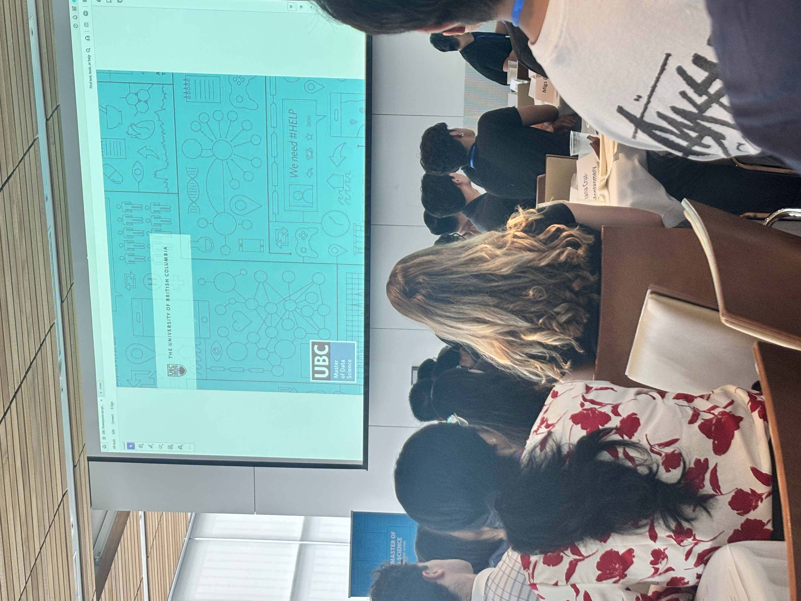

It genuinely feels like a month has already gone by. The pace here is fast, and it's so easy to fall behind if you don't stay on top of labs, worksheets, and readings. Thankfully I'm not doing this alone, I've made some wonderful friends along the way who make things feel a lot more manageable.
My favorite courses so far have been DSCI 521 (Computing Platforms for Data Science) and DSCI 523 (Programming for Data Manipulation). Learning how to build a website, and organize and clean data, all within the first week, has me genuinely excited for what's ahead. I know I'm in for a ride over the next 10 months. 
No, seriously, I can't wait!

